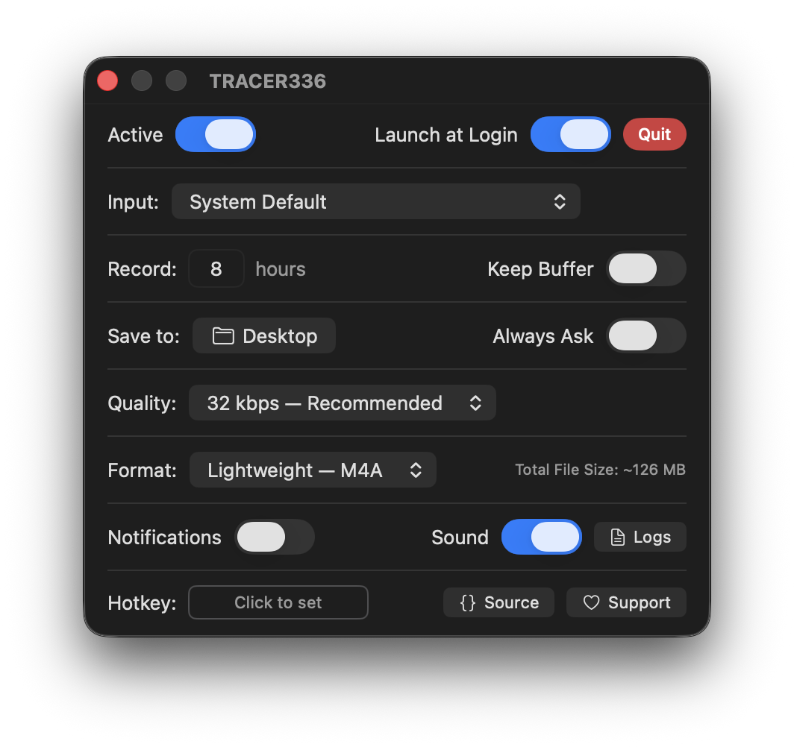

<table>
<tr>
<td>

# TRACER336

aite so pretty much there was this app I used to use that would record audio in the background. It came in clutch a few times and it was dead simple so I liked it. Then the app got sold and it got filled with bloat and now it's a AI company that doesn't even use AI for anything but it's just for appearances so they can please their VC overlords. I vibe coded this in 2 days. Claude is my best friend.

[](https://tracer336.com)
[](LICENSE)
[](https://github.com/afraaz-llc/TRACER336)
[](https://github.com/afraaz-llc/TRACER336/releases)
[](https://tracer336.com)

</td>
<td>


</td>
</tr>
</table>

<!-- Replace with a screenshot or demo GIF of the drag interaction -->
<p align="center">

</p>

## how it works

it sits in your menu bar and records audio to a rolling buffer. when you need to save something, you click and drag away from the icon. the further you drag, the more time you capture. let go and it saves to your desktop. that's the whole app.

the icon's rings spin while you drag like a tape spool. there's a rubber band snap when you hit the max range. when you release, the line reels back like a tape measure. it sounds like a small thing but it makes the interaction feel really good.

## install

### download

grab the latest `.dmg` from [Releases](https://github.com/afraaz-llc/TRACER336/releases), open it, drag TRACER336 to Applications. done.

### homebrew

```
brew install --cask tracer336
```

(coming soon, will submit the cask once the first release is stable)

### build from source

```
git clone https://github.com/afraaz-llc/TRACER336.git
cd TRACER336
open TRACER336.xcodeproj
```

hit ⌘R in Xcode. requires macOS 13+ and Xcode 15+. grant microphone permission when prompted.

## features

**privacy first** — all audio stays on your Mac. no cloud, no accounts, no analytics, no internet required. i literally cannot see your audio even if i wanted to.

**tiny** — under 5 MB. uses AAC compression at 32 kbps so 8 hours of buffer fits in about 126 MB of RAM. you'll forget it's running.

**drag to save** — drag distance equals time. no menus, no buttons, no dialogs (unless you want them). you'll have it memorized in 30 seconds.

**configurable** — pick your input device, recording hours (1 to 24), audio quality, export format (M4A or WAV), save location. set a global hotkey for quick save without touching the mouse.

**device aware** — if your mic disconnects, the icon turns red and recording pauses. reconnect it and recording resumes automatically. it never silently switches to a different device.

**engine recovery** — if the audio engine crashes (rare, but happens with Bluetooth), it automatically tries to restart up to 3 times. if it can't, it tells you.

**developer friendly** — every file is heavily commented. there's a built-in logging system with a real-time logs window. fork it and go nuts.

## settings

<p align="center">

</p>

the settings window has everything in one place: recording toggle, input device picker, retention hours, save location, export format and quality, notification and sound toggles, a global hotkey recorder, and a logs viewer for debugging.

there's a bluetooth warning when you pick a wireless mic, and a red alert when your device disconnects. the quality picker shows estimated file size so you know what you're getting into.

## architecture

```
TRACER336/
├── TRACER336App.swift       ← SwiftUI entry point
├── AppDelegate.swift        ← menu bar, drag gesture, window management
├── AppSettings.swift        ← UserDefaults with security-scoped bookmarks
├── AudioRecorder.swift      ← AVAudioEngine, circular buffer, export pipeline
├── MenuBarIconView.swift    ← 3-layer animated icon (CALayer)
├── MenuPopoverView.swift    ← quick actions popover
├── OverlayWindow.swift      ← transparent full-screen drawing surface
├── OverlayView.swift        ← line, dot, label, animations
├── SettingsView.swift       ← SwiftUI preferences panel
├── NotificationManager.swift ← macOS notification delivery
├── HotkeyManager.swift      ← global keyboard shortcut
├── HotkeyRecorderView.swift ← shortcut capture widget
├── Logger.swift             ← centralized logging with Combine
├── LogsView.swift           ← real-time log viewer (NSTextView)
└── Assets.xcassets/         ← SVG icon layers, app icon
```

the audio system records into 1-minute AAC chunk files in the temp directory. a timer rotates to a new chunk every 60 seconds and prunes old ones based on your retention setting. export concatenates chunks into an AVComposition and writes M4A (passthrough, near-instant) or WAV (decode to PCM).

the drag interaction uses euclidean distance from the icon center to calculate a ratio (0 to 1) which drives everything: line length, icon rotation, and seconds to export. all animations are timer-based at 60fps using RunLoop timers in .common mode so they work during gesture tracking.

## for developers

every significant app event flows through the `Log` system. categories: `.audio`, `.export`, `.ui`, `.settings`, `.notify`, `.system`. you can observe entries in real-time:

```swift
Log.shared.$entries
    .receive(on: DispatchQueue.main)
    .sink { entries in /* update your UI */ }
```

to add a custom log category:

```swift
extension Log.Category {
    static let myFeature = Log.Category(rawValue: "myFeature")
}

Log.info("hello from a new module", category: .myFeature)
```

to add a new setting:

```swift
// in AppSettings.swift
static let mySettingKey = "mySetting"
static var mySetting: Bool {
    return store.bool(forKey: mySettingKey)
}

// in SwiftUI
@AppStorage(AppSettings.mySettingKey, store: AppSettings.store)
private var mySetting = false
```

## updates

this app doesn't connect to the internet. like, at all. that's the whole point. but it also means it can't check for updates. so if something breaks or feels off, check the [releases page](https://github.com/afraaz-llc/TRACER336/releases) to see if there's a newer version. if there isn't, open an issue and i'll look at it. or honestly just fork it and fix it yourself. it's your code now.

## license

GPL-3.0. you can use it, modify it, distribute it, but if you build on it you have to keep it open source. that's the whole point. read the full license [here](LICENSE).